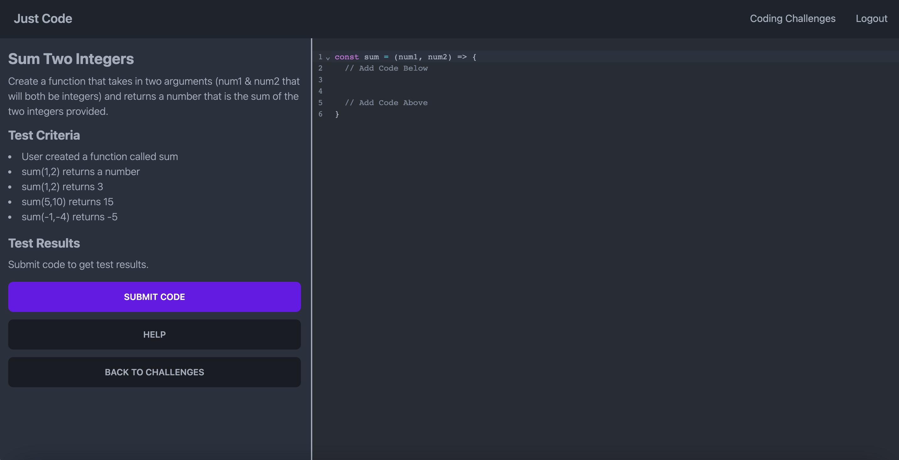

# Just Code (V2)



## Description

This project was created to help people learn how to code with javascript. I found that a lot of sights like hacker rank and leet code are good for studying advanced concepts, but not so great for people learning how to code. I created this site to help others learn how to code by creating simple straightforward problems to solve. These problems are also inspired from problems I have had to solve in my day to day job, instead of just fancy algorithmic problems meant to trip you up.

## View the live project

https://just-code.vercel.app/coding-challenges

## Built With

- Next.js (using the [T3 Stack](https://create.t3.gg/))
- Typescript
- Tailwind
- Supabase (sql)

## Run/Locally

1. First, make sure to clone this repo on your local machine

```bash
git clone https://github.com/Mark-Mulligan/just-code-v2.git
```

2. Inside the cloned repo, install all the app dependencies using a node package manager

```bash
npm install
# or
yarn install
# etc
```

3.  Setup a project on supabase. I chose to develope with a cloud supabase instance to make deployment easier. You will need to create an account then following the steps to create a project. Luckily, Supabase has a generous free tier so this should not cost you any money.

4.  After creating the project, you will need to setup authentication with both github and google. Supabase, makes this really easy and has good documentation so follow these their guide to setting up authentication for these services in your project.

5.  After setting up authentication in your project, you will need to create one table. Supabase exposes a sql editor in the ui of the project. You can use the editor to past in the following code. This should generate the needed table for this project to function

```create table
  public.completed_challenges (
    id bigint generated by default as identity not null,
    completed_at timestamp with time zone null default now(),
    user_id uuid not null,
    problem_key text not null,
    solution_code text not null,
    constraint completed_challenges_pkey primary key (id),
    constraint completed_challenges_user_id_fkey foreign key (user_id) references auth.users (id)
  ) tablespace pg_default;
```

6.  Once your supabase project is setup following the steps above, create a .env.local file in the root of the project. Use the .env.example to copy the need environment variables. You can find these values for these variables in your Supabase instance.

7.  To start the instance locally, run the following command

```bash
npm run dev
# or
yarn run dev
# etc
```

If everything was setup correctly, you should be able to run the app as normal.

## Contact

[My Github](https://github.com/Mark-Mulligan) <br>
mark.mulligan.jr1@gmail.com <br>
[Linkein](https://www.linkedin.com/in/mark-mulligan-50) <br>
[Portfolio](https://markmulligan.dev)

#### How to Contact Me

Feel free to reach out to me if you have any questions about this project. You can email me using the email listed above or can go to my github page to view my other projects and portfolio.

© Mark Mulligan 2023 All Rights Reserved.

This is a [T3 Stack](https://create.t3.gg/) project bootstrapped with `create-t3-app`.

## Learn More About The T3 Stack

To learn more about the [T3 Stack](https://create.t3.gg/), take a look at the following resources:

- [Documentation](https://create.t3.gg/)
- [Learn the T3 Stack](https://create.t3.gg/en/faq#what-learning-resources-are-currently-available) — Check out these awesome tutorials

You can check out the [create-t3-app GitHub repository](https://github.com/t3-oss/create-t3-app) — your feedback and contributions are welcome!
